     

# 🛡️ Awesome AI Red Teaming Platform Ecosystem

> **Curated List of SaaS Platforms & Open-Source Security Tools**  
> *Focused on LLM Jailbreak Testing, Prompt Injection Probes, Adversarial Evaluation, Agent Attack Simulation & Continuous AI Security Testing*

---

## 📌 Overview & Key Focus Areas

This repository tracks notable **SaaS platforms** and **open-source frameworks** for **AI Red Teaming** and **LLM Vulnerability Evaluation**. These security suites systematically attack models, AI applications, and autonomous agents—probing for jailbreaks, prompt injection, data leakage, toxicity elicitation, tool abuse, and guardrail bypasses before adversaries exploit them in production.

### 🔑 Key Domains Covered:
- ⚡ **LLM Jailbreaking & Automated Probing**: Systematic evaluation using adversarial prompt suites (e.g. TAP, Crescendo, PAIR).
- 🎯 **Prompt Injection Testing**: Direct and indirect prompt injection attacks against LLMs and agent toolsets.
- 🤖 **Agent Attack Simulation**: Vulnerability scanning for multi-agent workflows, tool abuse, and privilege escalation.
- 🛡️ **Continuous Automated Red Teaming (CART)**: Integrating AI vulnerability scanners into CI/CD pipelines.
- 📜 **Framework Compliance**: Mapping attack vectors to **OWASP Top 10 for LLMs**, **NIST AI RMF**, and **MITRE ATLAS**.

---

## 📋 Table of Contents
- [📊 Market Overview](#-market-overview)
- [🏢 SaaS/Hosted Platforms](#-saashosted-platforms)
- [🔓 Open-Source GitHub Projects](#-open-source-github-projects)
- [🤝 How to Contribute](#-how-to-contribute)
- [⚠️ Disclaimer](#️-disclaimer)
- [📈 Star History](#-star-history)

---

## 📊 Market Overview

> **Market Size & Industry Structure**:  
> The AI Red Teaming & LLM Security market is estimated at **$1.75 Billion (2025)** and projected to reach **$2.26 Billion in 2026** (growing at a CAGR of ~28.5%). The sector is currently **moderately fragmented** but experiencing rapid consolidation via M&A (e.g., major acquisitions by Palo Alto Networks, Cisco, OpenAI, Check Point, F5 Networks, Zscaler, and Fortinet). The industry is transitioning from manual, ad-hoc penetration testing toward Continuous Automated Red Teaming (CART) platforms integrated directly into AI engineering workflows.

---

## 🏢 SaaS/Hosted Platforms

The table below lists leading enterprise SaaS products for AI security testing, sorted **descending by Company Size / Funding / Valuation**.

| 🏢 Platform | 💰 Pricing (Starting Tier) | 🎁 Free Tier / Trial Limits | 📈 Company Size / Valuation / Funding | 📌 Key Capabilities & Focus |
| :--- | :--- | :--- | :--- | :--- |
| **[Protect AI](https://protectai.com/)** | Enterprise (~$25,000/year starting) | 14-Day Enterprise Trial (1,000 security scans limit) | **~$700M Valuation** (Acquired by Palo Alto Networks; $129M funding) | Full MLSecOps security suite, Recon automated red teaming, Guardian runtime guardrails. |
| **[Zenity](https://zenity.io/)** | Enterprise (~$15,000/year starting) | 30-Day Platform Evaluation (50 copilot scans limit) | **~$500M Valuation** ($185M total funding, Series C) | Governance & red-teaming platform for enterprise AI agents, copilots, and low-code workflows. |
| **[Lakera AI](https://www.lakera.ai/)** | Community Free ($0/mo); Paid from $99/month | Free Forever Community Plan (10,000 API requests/month) | **$300M Valuation** (Acquired by Check Point; $20M Series A) | Real-time prompt injection defense, Lakera Guard, and automated red teaming probes. |
| **[Robust Intelligence](https://www.robustintelligence.com/)** | Enterprise (~$30,000/year starting) | 30-Day Proof-of-Concept (2,000 probe runs limit) | **~$250M Valuation** (Acquired by Cisco; $50M total funding) | Automated AI risk management, model stress testing, and continuous algorithmic auditing. |
| **[HiddenLayer](https://hiddenlayer.com/)** | Enterprise (~$20,000/year starting) | 14-Day Guided Sandbox (500 risk scans limit) | **~$250M Valuation** ($150M total funding, $100M Series B) | AISec Platform, model threat scanning, and real-time adversarial detection. |
| **[Gray Swan AI](https://www.grayswan.ai/)** | Enterprise (~$12,000/year starting) | 14-Day Trial (500 adversarial red-team simulations) | **~$150M Valuation** ($40M Series A) | Automated AI safety benchmarking, multi-turn red teaming, and jailbreak evaluation. |
| **[Patronus AI](https://www.patronus.ai/)** | Enterprise (~$15,000/year starting) | 14-Day API Trial (2,500 safety eval calls limit) | **~$120M Valuation** ($37M total funding, Series B) | Automated LLM evaluation, hallucination detection, and custom adversarial attack suites. |
| **[Mindgard](https://mindgard.ai/)** | Enterprise (~$10,000/year starting) | 14-Day Trial (1,000 threat assessment tests) | **~$100M Valuation** ($34M total funding, Series A) | Continuous automated AI security testing & threat intelligence platform. |
| **[Promptfoo (Cloud)](https://www.promptfoo.dev/)** | Enterprise (~$99/month starting) | Free Forever CLI Plan (10,000 red team probes/month) | **$86M Valuation** (Acquired by OpenAI; $23M total funding) | Hosted enterprise dashboard for red teaming, SSO, role-based access, and team collaboration. |
| **[CalypsoAI](https://calypsoai.com/)** | Enterprise (~$18,000/year starting) | 14-Day Platform Trial (1,000 injection test calls limit) | **~$80M Valuation** (Acquired by F5 Networks; $38M total funding) | Enterprise LLM security testing, threat monitoring, and policy enforcement engine. |
| **[Virtue AI](https://virtue.ai/)** | Enterprise (~$10,000/year starting) | 14-Day Sandbox Access (250 model eval runs limit) | **~$60M Valuation** (Acquired by Fortinet; $30M total funding) | Generative AI risk assessment, safety scoring, and compliance probes. |
| **[Aporia](https://www.aporia.com/)** | Self-Serve Starter ($500/month) | Free Forever Starter Tier (10,000 tokens/month) | **~$50M Valuation** (Acquired by Coralogix; $25M total funding) | Real-time AI guardrails, prompt injection attack simulations, and observability. |
| **[SplxAI](https://splx.ai/)** | Enterprise (~$8,000/year starting) | 14-Day Free Trial (500 red-team prompts limit) | **~$30M Valuation** (Acquired by Zscaler; $10M total funding) | Domain-specific LLM red teaming, automated prompt injection probing, and security reports. |

---

## 🔓 Open-Source GitHub Projects

Below is a list of top open-source repositories for AI red teaming, vulnerability scanning, and guardrails evaluation, **sorted descending by GitHub star count**.

1. **[Promptfoo](https://github.com/promptfoo/promptfoo)**   
   *CLI & eval framework for LLM red teaming, prompt injection testing, OWASP LLM Top 10 coverage, and automated CI/CD security gates (MIT License).*

2. **[DeepEval](https://github.com/confident-ai/deepeval)**   
   *The open-source LLM evaluation framework—unit testing for LLMs, red-teaming probe generation, hallucination metrics, and toxicity evaluations (Apache 2.0).*

3. **[Arize Phoenix](https://github.com/arize-ai/phoenix)**   
   *AI observability & eval platform for LLMs—adversarial evaluation datasets, prompt vulnerability tracking, and agent tracing (ELv2).*

4. **[garak (NVIDIA)](https://github.com/NVIDIA/garak)**   
   *Leading open-source LLM vulnerability scanner—probe-based testing for jailbreaks, prompt injection, data leakage, toxicity, and failure mode scanning (Apache 2.0).*

5. **[Guardrails AI](https://github.com/guardrails-ai/guardrails)**   
   *Adding structure, type validation, and security guardrails to LLM outputs while testing defensive policies under attack (Apache 2.0).*

6. **[NeMo Guardrails (NVIDIA)](https://github.com/NVIDIA/NeMo-Guardrails)**   
   *Open-source toolkit for adding programmable rails to LLM-based conversational applications, frequently used as target suites for red-team verification (Apache 2.0).*

7. **[PyRIT (Microsoft)](https://github.com/Azure/PyRIT)**   
   *Microsoft’s Python Risk Identification Toolkit for Generative AI—orchestrated, multi-turn, adaptive red-team campaigns for AI agents and models (MIT License).*

8. **[Purple Llama (Meta)](https://github.com/meta-llama/PurpleLlama)**   
   *Meta's umbrella project for open-source cybersecurity tools (Llama Guard, CyberSec Eval) for trust, safety, and red-team evaluation.*

9. **[LLM Guard (Protect AI)](https://github.com/protectai/llm-guard)**   
   *Open-source input/output scanner designed to detect prompt injections, toxicity, data leakage, and security risks in real-time (MIT License).*

10. **[Rebuff AI](https://github.com/leptonai/rebuff)**   
    *Open-source prompt injection detection framework providing multi-layered defense and attack simulation vectors for LLM apps (Apache 2.0).*

11. **[HarmBench (CAIS)](https://github.com/centerforaisafety/HarmBench)**   
    *Standardized evaluation framework for automated red teaming and jailbreak robust testing across open and closed LLMs (MIT License).*

12. **[JailbreakBench](https://github.com/JailbreakBench/jailbreakbench)**   
    *Open benchmark for assessing LLM vulnerability to jailbreak attacks with standardized evaluation protocols and datasets (MIT License).*

13. **[Vigil LLM](https://github.com/deadbits/vigil-llm)**   
    *Open-source security scanner for prompt injection detection using vector databases, heuristic scanners, and canary tokens (Apache 2.0).*

---

## 🤝 How to Contribute

Contributions are welcome and appreciated! Follow these simple steps:

1. 🍴 **Fork** this repository.
2. 📝 **Add/edit** entries in `README.md` following the standard table/list format.
3. ℹ️ **Provide accurate details**: Name, link, starting tier pricing, free trial/tier limits, valuation/funding metric, and 1–2 sentence description.
4. 🚀 **Submit a Pull Request** with a clear explanation of your additions.

---

## ⚠️ Disclaimer

- This list is **community-curated** for educational, evaluation, and research purposes.
- **Ethical Testing Notice**: Always perform red-teaming and security testing strictly on systems you own or have explicit written authorization to evaluate.
- **Safety Precaution**: Adversarial testing may generate harmful or policy-violating outputs. Store and process evaluation datasets securely.

---

## 📈 Star History

---

 Made with ❤️ for AI security engineers, red teams, and developers hardening LLMs &amp; Agents. 

